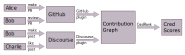
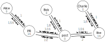
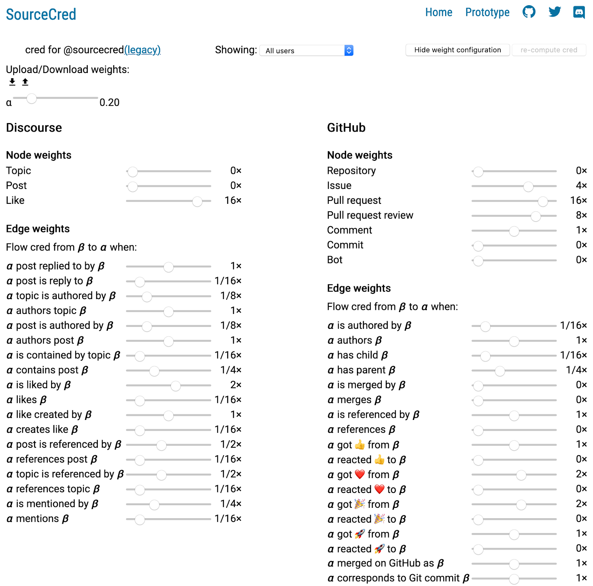
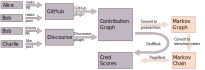
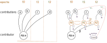

# An introduction to calculating cred and grain

I’m starting from the assumption that you have some familiarity with the SourceCred project. If you don’t, then I’d suggest you check out Dandelion's [20 minute talk (+Qs) from SustainWeb3](https://www.youtube.com/watch?v=yVTqRLekRl4) and some of the other documents in this repo.

Overall, I’m going to throw around a little math, but you should be able to get solid intuition on this if you’re comfortable talking about a [graph](https://en.wikipedia.org/wiki/Graph_theory) as a set of nodes and edges, where the edges connect nodes, can be directed, and can have weights. I’ll also explain [the PageRank algorithm](https://en.wikipedia.org/wiki/PageRank), which computes “importance” of nodes in a graph based on the “importance” of nodes connected to it, and I’ll motivate the intuition behind it as well when I cover it, but if you like having a strong formal background, Brilliant.com’s explanation of [Markov Chains](https://brilliant.org/wiki/markov-chains/#transition-matrices), [Stationary Distributions](https://brilliant.org/wiki/stationary-distributions/) and [their quiz](https://brilliant.org/practice/basic-markov-chains) are more than sufficient. If you just want to get to the explanation, I'll also define terms as they come up.

## The high level overview

SourceCred takes information about contributions and generates what we call a contribution graph, and this post will first explain what that graph is and where it comes from. We then discuss how, from this contribution graph, SourceCred runs the CredRank algorithm to generate cred scores. This graph of cred is then used to distribute grain. The grain can then be kept or traded, and soon will be able to be used to influence the contribution graph in the future. This overall process is diagrammed in the figure below.

> Figure 1. A very high level overview of how SourceCred allocates cred and grain, distinguishing between actions taken by contributors and those taken by the SourceCred algorithm.

The rest of this document first outlines how collaboration data is gathered and structured before going into how the exact amounts of cred and grain are calculated, and ends with some future directions SourceCred as a project is considering.

## Components of contributing in SourceCred

SourceCred first generates a contribution graph from the input data. In this graph, a node is a contributor or contribution, and edges represent some sort of connection between the nodes. These connections are intended to include all possible ways that a contribution or contributor on a platform can express dependencies, thanks, or flows of value. Examples would include anything from a mention on a forum post to liking or merging a PR on GitHub.

It's worth pausing for a moment to make a distinction. In graph theory, a **weighted graph** has weights on the edges, whereas, the SourceCred **contribution graph** has weights on both edges and nodes and a few other features. I'll probably manage not to talk about weighted graphs unless I'm talking about an example from graph theory.

#### Nodes:

Contributions are represented as nodes in the graph, and are given addresses to identify them uniquely. These addresses include a prefix, which takes the form: `[organization making the plugin that generates the node] + [name of the plugin] + [type of contribution]` (e.g. topic/post/user/like).

Contributors are also represented as nodes in the graph. These nodes are similarly prefixed, and connected to contributions with directed edges, as illustrated in the figure below. For example, if an author node creates an issue, the author node gets an incoming edge from the issue node. Or if an author of a Discourse post mentions another contributor in the post, the post creates an outbound edge coming from the author.

Lastly, initiatives are another type of node that serve as a high level place to connect relevant nodes and discuss governance. It's similar to a tracking issue, but generalized across the contribution graph, providing a way to organize planned work for a well-scoped task.

#### Weights:

Both nodes and edges have weights, and an edge object in the SourceCred implementation can have forward and backwards weight. We’ll get into what these weights mean shortly, but for now, it’s worth noting that these weights can easily be set by address prefix. Setting by prefix is implemented as a multiplicative update; for example, setting issue comments to be worth twice an issue emoji reaction creates a 2:1 ratio that is preserved by decreasing GitHub’s edge weights by a factor of 2 relative to those of Discourse. Additionally, an edge can start and end on the same node (loops), which could be relevant when a piece of content is edited, or an contribution references itself.

> Figure 2: An example of a contribution graph, where the nodes include three different contributors each making a contribution. The directed, weighted edges are connections between the contributions. It’s a [directed graph](https://en.wikipedia.org/wiki/Graph_theory#Directed_graph) with weights on nodes and edges. How weights (violet) are assigned will be covered in the section on Generating the contribution graph.

#### Timestamps:

Additionally, because edges are associated with actions or events, they will always have a timestamp that corresponds to when the action or event occurred. Nodes don't need a timestamp, since the edge will carry information about the moment of the contribution.

#### Summary up to this point:

Now that we know about components of the contribution graph, their properties, and how they fit together, let’s cover how they’re generated.

## Generating the contribution graph

#### Plugins:

SourceCred uses APIs of collaboration platforms to gather information about contributions. Currently there are plugins for GitHub and Discourse ([code](https://github.com/sourcecred/sourcecred/tree/master/src/plugins)), and we’re enthusiastic to have more plugins, so we can account for contributions in different venues. This includes Discord (in progress), and could extend to Twitter, Reddit, or citations on the [arXiv](https://arxiv.org/) or [eprint](https://eprint.iacr.org/).

#### Weight parameters:

Because these plugins incorporate data from all sorts of contributions and output a single directed graph with weights (for nodes and edges), there needs to be a way to quantitatively compare actions (e.g. authoring a GitHub issue vs responding or referencing it). To accomplish this, there’s a set of constants that determine weights for nodes and edges. For an example set of constants, see the below figure, captured from [sourcecred.io/cred/timeline/@sourcecred/](https://sourcecred.io/cred/timeline/@sourcecred/) (follow the link and click the “Show weight configuration” button).

> Figure 3. A set of weight sliders to set parameters controlling the relative weights of different contributions.

Additionally, parameters, cred, and grain are all scoped to a community. This means that the community that supports a project sets and controls the parameters. For that matter, it’s worth reiterating that (lowercase) cred and grain generated for a project are specific to that project. SourceCred is about providing community control, keeping humans in the loop, both for gaming mitigation and general adaptability. At the bottom line, it’s important to keep the humans in control, because good governance technology only works with the consent of the governed.

#### Manual input:

It’s also worth noting that not all contributions occur on platforms with automated data fetching, and thus the capability exists to individually add them to the contribution graph directly at this stage. It’s clear that there will always be data that has to be incorporated manually, and how to incorporate those contributions, especially those not easily quantified, remains an active area of discussion.

#### Merging graphs:

A plugin will use the API for the collaborative workspace app or platform to generate a graph of nodes and edges. One interesting caveat is that there isn't necessarily one most-intuitively correct way to merge two contribution graphs if they share either edges or nodes (i.e. how would we calculate the combined weight). Currently, a combined contribution graph is generated from the union of the nodes and edges from each plugin's contribution graph, with only each contributor's identities across platforms collapsed into one single identity. If the nodes and edges of the contribution graph are found not to be disjoint, an error is thrown; however it's expected that any given contribution or connection will only be captured on one platform.

#### Summary up to this point:

So at this point, we’ve got data from all our sources combined in one directed graph, where contributions and contributors are nodes, interactions and connections between nodes are edges; both nodes and edges have a relative weight based on parameters the community has set, and we’re ready to run CredRank on it.

## SourceCred’s CredRank algorithm - motivation

The goal of CredRank is to calculate the relative importance of nodes based on our contribution graph, specifically the weights of the nodes and edges. We'll also cover some intermediate calculations shown in the figure below, which illustrates an expanded overview of SourceCred. In particular, it includes adding some nodes for cred calculation and converting weights in our contribution graph to probabilities to eventually run PageRank; a [Markov chain](https://en.wikipedia.org/wiki/Markov_chain) is a set of states with probabilities describing the likelihood of transitioning between states.

> Figure 4. An expanded illustration of the process by which SourceCred gathers data from collaboration platforms, generates a contribution graph, and runs CredRank to generate cred scores. The CredRank algorithm is expanded in detail to distinguish steps of adding Markov nodes specific to SourceCred, generating a Markov Chain, and calculating the stationary distribution.

Before going into those details, let's motivate the role of probabilities in calculating cred.

#### Contribution importance as a stationary distribution

Starting from our contribution graph, we want to calculate cred, the relative importance of nodes. We start with the intuition that any contribution's importance is explicitly validated by future contributions, and the strength of that validation is greater if it comes from contributions that are, in turn, more significant.

As a metaphor, we can visualize cred flowing through the graph as water flowing through a watershed ecosystem of creeks, springs, and ponds:

- Water bubbles up at certain locations where there are springs feeding ponds. These correspond to actions that mint cred.
- Water flows through streams connecting ponds. The flow to downstream nodes is proportional to the strength of the connection.
- Additionally, water from all of these ponds seeps into the ground, replenishing the springs and providing a closed loop.
- Finally, the equilibrium water level in each pond is proportional the relative importance of that node.

The contribution graph tells us the size of various creek beds, but we want to know the distribution of destinations for the water that leaves each pond. We can equate the paths a different water droplet can take to the transition probabilities in a Markov chain. With these numbers, we can calculate equilibrium distribution of water, called the stationary distribution on a Markov chain.

We'll cover how we run this calculation after a brief digression on where cred comes from and a motivation for time-based cred.

#### On the origin of cred

The weights of the nodes are used to determine the amount of cred minted for each action (i.e. rate at which each spring adds water). This newly-minted cred flows to connected nodes, but the total amount of cred minted by contributions will be the total amount received by contributors. In this way, the total amount of cred increases in proportion to amount of cred-generating activity on the project itself.

#### Cred-minting philosophy

As a matter of design philosophy, we believe cred should be minted at moments where there is review of an action, rather than the action itself.
This reduces the danger of spam and reinforces the idea that contributors dictate what is valuable. For other projects adopting SourceCred, contributions that mint cred could also be actions performed by a moderator or maintainer.

#### Motivating time-based cred

We believe that contributions should be valued based on their current impact, regardless of when the contribution was made. As a result, a past action that was recently found to be valuable in the present should cause new cred to flow to that action, while a buggy feature that was replaced for being not easily maintained can cause their cred decrease after the substitution has been made.

In order to accommodate these properties over time, we have adopted a model that creates "epoch nodes" that, in effect, act like time-bounded identities for each contributor for each time period. The evolution of a user's cred over time can then be quickly evaluated by summing over epoch nodes without having to recalculate a stationary state.

## SourceCred’s CredRank algorithm - calculation

Let's now describe this process in the concrete steps.

#### The seed node

First we add our flow from every node to replenish the groundwater. We create a "seed node" to which all nodes transfer cred at rate α. Note that, other than α, the contribution graph only has weights at this point. At the end of the next step, we'll convert all the weights to probabilities as well. Because the groundwater supplies the springs, we create edges from the seed node to the various nodes in the contribution graph, where the weight of the new edge is the weight of the node.

#### Time epochs and fibration

Then we add epoch nodes to facilitate our calculation of cred over time.

To simplify the computational overhead and storage required to compute cred over time, SourceCred is moving toward a fibration model where a node is added per contributor, per unit time (currently weekly for SourceCred). In this model, epoch nodes intermediate flows to a user from any nodes during a period of time, and have a fixed transition probability to the user’s node, β (note that, like α, this is also a probability, not a weight).

A given user's epoch nodes are connected to each other with transition rates  and , connecting forward and backward in time, respectively. These sets of edges in the Markov graph are referred to as "webbing" elsewhere. These transition rates are shown below in Figure 5.

> Figure 5. An illustration of the original implementation of time-weighted cred (left), in which PageRank is re-calculated at each time-step, incorporating only nodes from previous time intervals. This is contrasted with the fibration model (right), in which an epoch node is added per epoch **per contributor** (orange), and cred flows to the contributor through the epoch nodes at rate β. Additionally, each epoch nodes connects to that user's epoch node one step forward and backward in time at rate 𝛾. The cred flows from each non-epoch node to the seed node at rate α (violet), and from the seed node according to the node weights (pink) are also shown.

The motivation for these contributions is two-fold. Firstly, your cred in the project should have some inertia over time, stabilized across epochs. Additionally, if you make a contribution at the beginning of one epoch, it's likely that some if not most of the work took place in a previous epoch, and thus some cred should flow between epochs.

#### Finishing conversion to a Markov chain

Each node now has a mix of transition probabilities and edge weights. After checking that the transition probabilities sum to less than one, the remaining transition probability is then shared between the outbound edges in proportion to their weights. For example, a node with outbound transition rate α=0.1 and outbound edge weights of {1,1,2,4} will have transition probabilities {0.1125,0.1125,0.225,0.45} along those edges; note that probabilities preserve relative weights.

At this point we can easily generate a pure Markov process from our modified contribution graph; all we have left to do is collapse any edges linking the same two nodes into one edge by summing the probabilities (i.e. two interactions that both flow cred from one node to another)

#### Solving for the stationary distribution

It should be fairly clear that our goal is to calculate the equilibrium amount for each of the **n** nodes. We have **n** potential flows to all others nodes, all known. Since the total flow is conserved (flow in = flow out for each node), we can write **n** equations with **n** unknowns, which we could solve for the equilibrium cred.†

#### Stationary distribution as an eigenvector

If you’ve spend time in linear algebra land, you’ll be pleased to hear that common way to compute this (in algebraic graph theory) is to convert the graph to a matrix _P_ where each entry  is the transition probability from node _u_ to node _v_. Each dimension corresponds to a node, and the matrix maps from all nodes to all nodes. Then finding the stationary distribution is the same as finding [the eigenvector](https://www.youtube.com/watch?v=PFDu9oVAE-g) of the transition matrix that corresponds to eigenvalue 1; by the definition of an eigenvector, this vector is the distribution of value to each node such that if value flowed down each edge in proportion to its weight, the resulting value distribution would remain the same.

#### Cred from a stationary distribution:

Once we've computed the stationary distribution, we have a "raw score" assigned to every node in the graph. These scores form a probability distribution, so they sum to 1. However, we want cred scores; which means that the "total amount of cred" should sum to the total amount of cred minting, i.e., the total node weights.

Therefore, we compute: _m_, the sum of all node weights in the graph, and _s_, the sum of all raw scores received by "scoring nodes" (typically users). Then, for any node _n_, its cred score  is derived from its raw score  by: . This ensures that the sum of all users' cred is equal to the total amount of cred that was minted. This means that the total amount of cred grows over time, as the number of contributions that mint cred increases.

We now discuss how grain, SourceCred's "proof-of-support" token, is calculated from this and distributed.

## Grain dynamics

#### How much grain is generated

Once SourceCred calculates the cred for individual contributors, that cred is linked to an identity that is an amalgamation of their identities across the platforms (e.g. GitHub handle or Discord username). A constant amount of SourceCred grain (¤) is produced per unit time, currently 15000¤ per week. This amount is distributed according to two different distribution mechanisms.

- 20% of the grain is “fast,” and is disbursed to nodes in proportion to the cred earned by each node in the past week. This is intended to provide fast feedback.
- 80% of the grain is “slow,” and is disbursed in proportion to the difference between total grain you've been distributed, and what that node’s proportional fair cred would be over all history. This is intended to ensure that everyone is rewarded in proportion to their lifetime contributions.

For example, if your past work was unrecognized until recently, your slow payment should reflect the recently recognized value of the contribution. Alternatively, if you joined this week, you’ll only have fast grain. It's also possible that a change in the algorithm or weights imply a contributor was over-paid in the past, and thus won't receive any slow payments for a while. The fast component can potentially over-distribute grain, but it will get diluted by other contributions.

There are some interesting second-order dynamics here relating the rate of "cred inflation" vs "grain inflation":

- If grain is minted faster than cred, then the slow payment will pay all contributors (even inactive contributors) because the lifetime grain-per-cred value is increasing.
- If cred is inflated faster than grain, then the slow payment will only pay recipients of "new" cred, i.e. an inactive contributor whose cred stays constant would stop receiving slow payments (because they already reached target grain-per-cred for their amount of cred).

#### How grain is traded:

Grain payouts are currently tracked by Dandelion in an observable notebook linked to in [this Discourse thread](https://discourse.sourcecred.io/t/sourcecred-contributor-payouts/298). We currently consider grain a "preview" or experimental balance, though we plan to honor it going forward. As a result, actually receiving grain is an opt-in process. If you opt in, there may be financial or tax liabilities; if you don't, it currently seems like grain is just a number in a list. Additionally, grain distributions will vest over time in order to smooth out the peakiness of grain distribution, as described in [this Discourse thread](https://discourse.sourcecred.io/t/grain-vesting/636). Even now, grain can be sold or given. In fact, [Protocol Labs](https://protocol.ai/) supports SourceCred by purchasing grain directly from contributors. At present, the transfer of grain is executed by recording changes to the observable notebook on GitHub [here](https://github.com/sourcecred/cred).

## Future roadmap features

#### Boosting:

The next big feature on [the SourceCred roadmap](https://discourse.sourcecred.io/t/sourcecred-beta-roadmap/422) is boosting, outlined in [this discourse post](https://discourse.sourcecred.io/t/cred-boosting/257). The expectation is that anyone would be able to spend their grain by permanently staking it on a node. This action would increase that node’s weight, and adds an edge in the graph from the node back to the individual who boosted it. Boosting issues, PRs, or initiatives has the effect of increasing visibility and importance of those nodes, and can work to speculate on the future importance of fixing those bugs or adding those features. Boosting users, alternatively, has the effect of sponsoring someone to work on the project.

#### ERC20 grain:

SourceCred also intends to create grain as an ERC20 token, outlined in [this discourse post](https://discourse.sourcecred.io/t/an-erc20-to-track-grain/386). It’s expected that running the cred calculation will be too heavy for a smart contract, but an oracle could provide the cred values to the chain, allowing both cred and grain to be accounted for on-chain.

#### Meta-cred and meta-grain:

We also hope that other projects will adopt and use SourceCred, which will result in the creation of multiple project-specific cred and grain values. We should be able to create a meta-cred graph, where each node is a project (rather than a contribution) and edges are dependencies; at this point, meta-cred and meta-grain allow us to flow value across the complete ecosystem.

#### Decentralized governance:

Using cred or grain for governance is not on the current roadmap, but it’s pretty intuitive how the system might work, with weights being set by a DAO. Decentralizing the governance is definitely part of the plan, but the project isn’t quite ready for it yet.

Additionally, it’s worth looking at github for [the current project status](https://github.com/sourcecred/sourcecred/blob/master/README.md).

† It's worth noting that a Markov process is guaranteed a stationary distribution only if the process is ergodic and irreducible. Other than stating that our seed node makes our Markov process satisfy these, it's not worth considering at this depth. I would encourage a curious reader to continue their exploration of ergodicity on [wikipedia](https://en.wikipedia.org/wiki/Ergodicity#Markov_chains), [Brilliant](https://brilliant.org/wiki/ergodic-markov-chains/), or your favorite reference.
